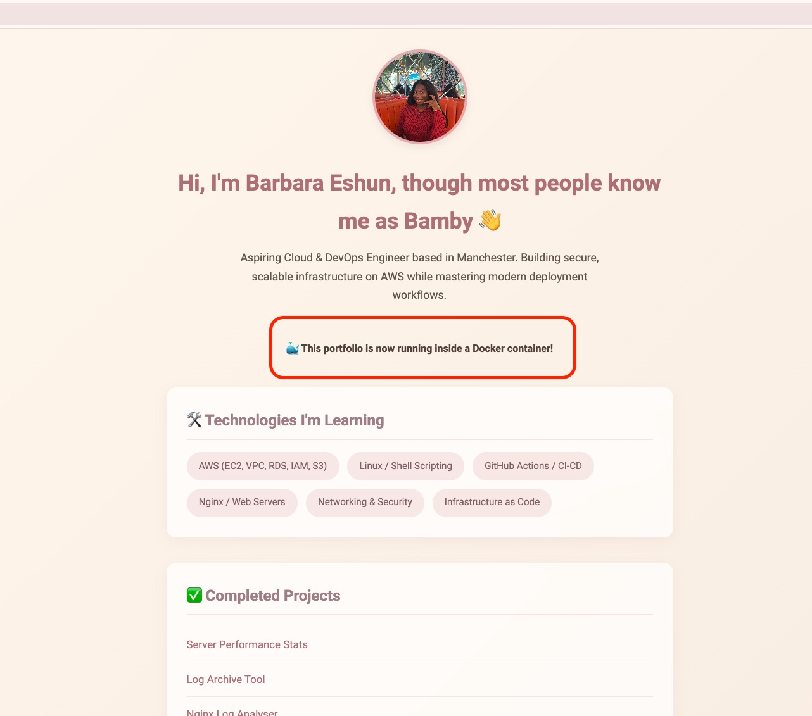
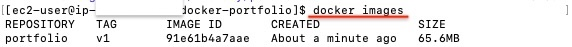
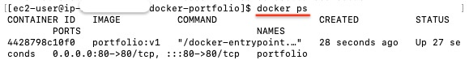

# :whale: Containerised Static Portfolio Website

---

# :dart: Project Overview

This project demonstrates how to containerise a static portfolio website using **Docker** and **Nginx** on an AWS EC2 instance running Amazon Linux 2023.

Instead of installing Nginx directly on the operating system, the web server runs inside a Docker container, making the application portable, lightweight and easy to deploy.

---

# :rocket: Technologies Used


• AWS EC2.
• Amazon Linux 2023.
• Docker.
• Nginx (Alpine).
• HTML5.
• CSS3.
• SSH.
• SCP.

---

# :file_folder: Project Structure

```
docker-portfolio/
│
├── Dockerfile
├── index.html
├── style.css
├── images/
│   └── profile.jpg
└── README.md
```

---

# Project Screenshots

## Portfolio running inside Docker + Nginx

<div align="center">
  
</div>

---

## Docker Image Successfully Built

<div align="center">
  
</div>

---

## Running Container (`docker ps`)

<div align="center">
  
  <p><em>Output confirming the container is up and serving on port 80</em></p>
</div>

---

# :memo: Dockerfile

```dockerfile
FROM nginx:alpine

COPY . /usr/share/nginx/html

EXPOSE 80
```

---

# :computer: Step-by-Step Implementation

## 1. Created the project locally (Mac)

Created a dedicated project folder.

```bash
mkdir -p ~/Projects/docker-portfolio

cd ~/Projects/docker-portfolio
```

Created the Dockerfile and copied the portfolio website files into the project folder.

---

## 2. Copied the project to AWS EC2

Transferred the complete project from my Mac to the server.

```bash
scp -r -i ~/.ssh/MyKeyPair.pem docker-portfolio ec2-user@<PUBLIC-IP>:~/
```

---

## 3. Connected to the server

```bash
ssh -i ~/.ssh/MyKeyPair.pem ec2-user@<PUBLIC-IP>
```

---

## 4. Installed Docker

```bash
sudo dnf install -y docker

sudo systemctl enable --now docker
```

Added my user to the Docker group.

```bash
sudo usermod -aG docker ec2-user

newgrp docker
```

---

## 5. Built the Docker image

```bash
docker build -t portfolio:v1 .
```

After updating my website I rebuilt the image.

```bash
docker build --no-cache -t portfolio:v2 .
```

---

## 6. Started the container

```bash
docker run -d \
-p 80:80 \
--name portfolio \
portfolio:v2
```

Verified it was running.

```bash
docker ps
```

Viewed logs.

```bash
docker logs portfolio
```

---

## 7. Updated the Website

While completing the project I updated my portfolio by adding:

:whale: Hosted with Docker

I also fixed the profile image after moving it into an `images` folder and updating the HTML path accordingly.

---

# :warning: Challenges I Faced

Like any real project, I encountered several issues during deployment.

### Permission Denied

Docker returned:

```
permission denied while trying to connect to the docker daemon socket
```

**Cause**

My user (`ec2-user`) had not yet been added to the Docker group.

**Solution**

```bash
sudo usermod -aG docker ec2-user

newgrp docker
```

---

### SCP Failed

Initially I couldn't copy the project to my EC2 instance.

The issue was that I was running the command from inside the project folder instead of its parent directory.

Once I navigated back to my `Projects` folder and used:

```bash
scp -r ...
```

the upload completed successfully.

---

### Profile Image Not Displaying

The browser displayed the alt text instead of my photo.

**Cause**

The image had been moved into an `images` folder but the HTML was still referencing the old location.

**Fix**

Updated:

```html

```

to

```html

```

---

### Docker Cache

After updating my website I noticed the changes weren't appearing.

I learned that Docker images are snapshots, so after changing my HTML I needed to rebuild the image.

Using:

```bash
docker build --no-cache
```

forced Docker to create a fresh image with the latest files.

---

# :books: What I Learned

:white_check_mark: Difference between Docker Images and Containers

:white_check_mark: Building images from a Dockerfile

:white_check_mark: Running containers

:white_check_mark: Docker networking and port mapping

:white_check_mark: Docker image caching

:white_check_mark: Troubleshooting permissions

:white_check_mark: Managing containers

:white_check_mark: Deploying a static website with Nginx

---

# :bulb: Key Takeaway

One of the biggest lessons from this project was understanding that:


**An Image is the blueprint. A Container is the running application.**

Changing the source files does **not** automatically update a running container.

The workflow is:

```
Edit files

↓

Build a new image

↓

Stop old container

↓

Remove old container

↓

Run new container
```

Understanding this concept made Docker "click" for me.

---

# :pushpin: Future Improvements


• Push the image to Docker Hub.
• Deploy using Docker Compose.
• Deploy to AWS ECS.
• Add HTTPS using Nginx.
• Automate deployment using GitHub Actions.

---

# :white_check_mark: Project Status

**Completed Successfully**
